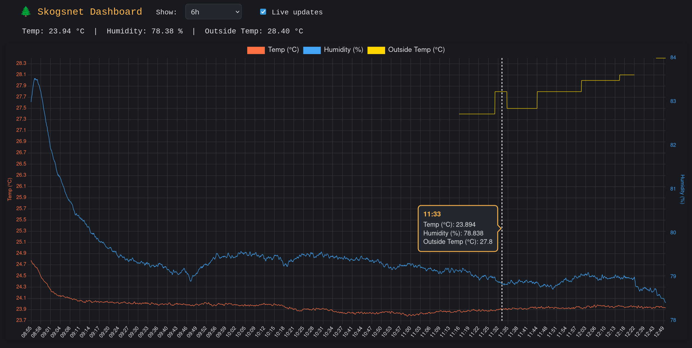

# Skogsnet v2

Skogsnet v2 is a Go application for reading temperature and humidity measurements from a serial device, saving them to a SQLite database. It features a web dashboard for visualizing the data, configurable logging, and the ability to export measurements to CSV. It also integrates with the OpenMeteo API to fetch current weather data, displaying it alongside the measurements.


## Features

- **Serial Data Acquisition:** Reads JSON-formatted measurements from a serial port (default: `/dev/ttyACM0`)
- **Database Storage:** Saves measurements to a SQLite database (`measurements.db`)
- **Console Output:** Prints each measurement in a readable, color-formatted style
- **Graceful Shutdown:** Handles Ctrl+C or SIGTERM cleanly
- **CSV Export:** Export all measurements to a CSV file with a single flag
- **Configurable Logging:** Log to a file with log levels (info, warn, error)
- **Web Dashboard:** Visualize measurements interactively with time range selection, dual axes, dark mode, and live updates
- **Weather Data Integration:** Fetches current weather data from OpenMeteo API and displays it alongside measurements

## Requirements

- Go 1.18 or newer


## Build

```sh
mkdir -p build
go build -o build/skogsnet_v2 ./internal
```

## Test
```sh
go test ./internal
```

## Configuration

The following CLI flags are available:

```
./build/skogsnet_v2 -h

Usage of ./build/skogsnet_v2:
  -baud int
    	Serial baud rate (default 9600)
  -city string
    	City name for weather data
  -dashboard
    	Serve web dashboard at http://localhost:8080
  -db string
    	SQLite database filename (default "measurements.db")
  -export-csv string
    	Export measurements to CSV file and exit
  -log-file string
    	Log output to file (optional)
  -port string
    	Serial port name (default "/dev/ttyACM0")
  -weather
    	Enable periodic weather data fetching
```


## Run

```sh
# Only sensor data acquisition and storage
./build/skogsnet_v2

# With logging, weather data, and dashboard enabled
./build/skogsnet_v2 -log-file=skogsnet.log -dashboard -weather -city=Helsinki
```

## Output

- Measurements are stored in a SQLite database file named `measurements.db`.
- Console output example:
```
Measurement at 2025-07-14 16:50:08
    Temperature:         23.78 °C
    Humidity:            76.06 %

    Weather:             Overcast
    Outside Temperature: 27.00 °C
    Outside Humidity:    44%
    Wind Speed:          6.60 m/s
    Wind Direction:      22° N
    Cloud Cover:         0%
```

## Web Dashboard

- **Features:**  
  - Interactive chart with dual axes (°C and %)
  - Time range selection: 1h, 6h, 12h, 24h, today, week, month, year, all
  - Live data updates (toggleable)
  - Responsive dark mode design
  - 24h time labels

- **Access:**  
  Start with `-dashboard` and open [http://localhost:8080](http://localhost:8080)




## License
MIT License